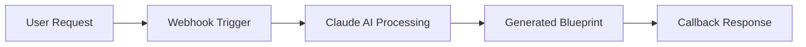

# 🤖 AI Scenario Builder - Meta-Automation for Make.com

A simple but powerful Make.com scenario that uses Claude AI to generate other Make.com scenarios based on natural language descriptions. This is "meta-automation" - AI that creates automations!

## 🎯 What It Does

1. **Input**: You describe what you want to automate in plain English
2. **AI Processing**: Claude analyzes your request and generates a complete Make.com blueprint
3. **Output**: You get a ready-to-import JSON file that you can use in Make.com

## 📁 Project Files

### Core Files
- **`ai-scenario-builder.json`** - The main Make.com scenario blueprint
- **`ai-scenario-builder-guide.md`** - Comprehensive setup and usage guide

### Testing Tools
- **`test-ai-builder.py`** - Python command-line test client
- **`ai-builder-test.html`** - Beautiful web interface for testing

### Documentation
- **`README.md`** - This file

## 🚀 Quick Start

### 1. Import the Scenario
```bash
# Import ai-scenario-builder.json into your Make.com account
```

### 2. Configure Claude API
- Get a Claude API key from Anthropic
- Replace `YOUR_CLAUDE_API_KEY` in module 3

### 3. Test It
**Option A: Use the Web Interface**
```bash
# Open ai-builder-test.html in your browser
```

**Option B: Use Python Client**
```bash
python test-ai-builder.py "Send me daily weather emails"
```

**Option C: Direct API Call**
```bash
curl -X POST "YOUR_WEBHOOK_URL" \
  -H "Content-Type: application/json" \
  -d '{
    "description": "Monitor Google Sheets and notify Slack",
    "callback_url": "https://httpbin.org/post"
  }'
```

## 💡 Example Automations You Can Generate

- **📧 Email Automation**: "Send me daily weather emails at 8 AM"
- **📱 Social Media**: "Auto-post Instagram photos to Twitter and LinkedIn"
- **📊 Data Processing**: "Monitor Google Sheets and notify Slack"
- **📝 Content Creation**: "Create Notion pages from email attachments"
- **🛒 E-commerce**: "Send Slack alerts for new Shopify orders"
- **📅 Calendar**: "Create calendar events from Trello card due dates"

## 🏗️ How It Works



1. **Webhook Trigger**: Receives your automation description
2. **Claude Processing**: AI analyzes and creates Make.com blueprint
3. **Blueprint Generation**: Complete JSON ready for import
4. **Response**: Sends result to your callback URL

## 🔧 Technical Details

### Scenario Flow
1. **Module 1**: Webhook trigger (receives requests)
2. **Module 2**: Variable setter (stores user request)
3. **Module 3**: Claude API call (generates blueprint)
4. **Module 4**: Variable setter (stores generated blueprint)
5. **Module 5**: HTTP response (sends result to callback)

### API Integration
- Uses Claude 3.5 Sonnet model
- Anthropic API v1 endpoint
- Structured prompts for consistent output
- Error handling and timeouts

## 🎨 Features

- ✅ **Simple Setup**: Just import and add your API key
- ✅ **Multiple Interfaces**: Web UI, Python client, direct API
- ✅ **Smart AI**: Claude understands complex automation requirements
- ✅ **Ready-to-Use**: Generated blueprints work immediately
- ✅ **Error Handling**: Graceful failure management
- ✅ **Beautiful UI**: Modern, responsive web interface

## 🔮 Future Enhancements

- **Scenario Editing**: Modify existing scenarios with AI
- **Template Library**: Pre-built scenario templates
- **Visual Builder**: Drag-and-drop interface
- **Multi-Model Support**: GPT-4, Gemini integration
- **Scenario Optimization**: AI-powered performance improvements

## 🤝 Contributing

This is a simple proof-of-concept that demonstrates the power of AI-generated automations. Feel free to:

- Improve the Claude prompts for better blueprint generation
- Add support for more Make.com modules
- Create additional testing tools
- Enhance the web interface

## 📄 License

Open source - use and modify as needed!

---

**Built with ❤️ using Claude AI and Make.com**

## Project Overview
The AI Scenario Builder is a tool designed to automate the creation of Make.com scenarios using AI. It leverages the Claude AI model to generate fully-configured blueprint JSON files with enhanced documentation.

## Setup Instructions
1. Clone the repository.
2. Navigate to the project directory.
3. Ensure all dependencies are installed.
4. Run the application using the provided scripts.

## Usage
- Use the mobile app interface to describe your automation needs.
- The app will generate a Make.com scenario blueprint based on your input.
- Review and import the generated blueprint into your Make.com account.

## Contributing
Contributions are welcome! Please fork the repository and submit a pull request.

## License
This project is licensed under the MIT License. 
